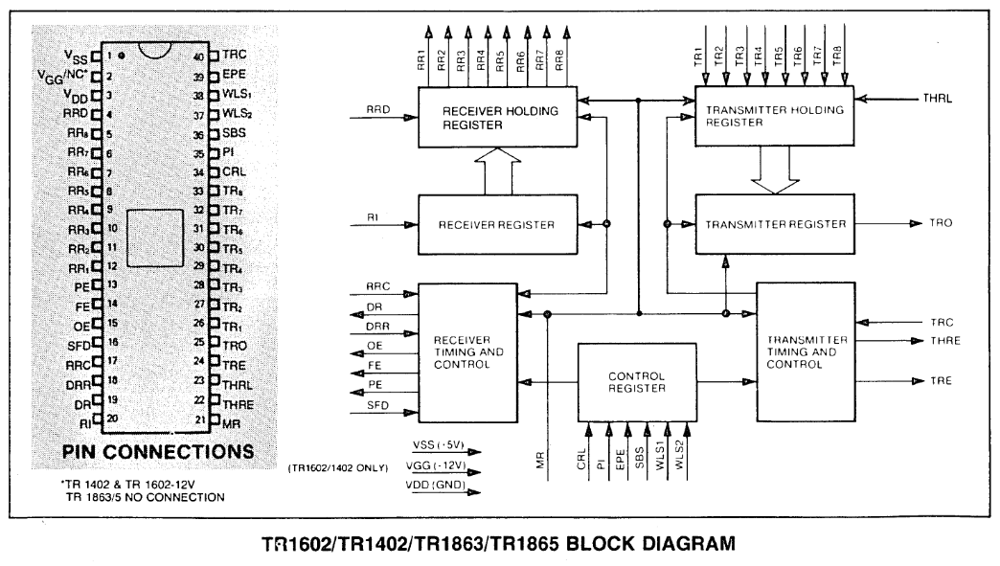

# WD1402A

## Block Diagram

## Features

- DUAL POWER SUPPLY TR1602/TR1402
- SINGLE POWER SUPPLY - +5VDC ON TR1863/5
- D.C. TO 1 MHZ (64 KB) (STANDARD PART) TR1863/5
- FULL DUPLEX OR HALF DUPLEX OPERATION
- AUTOMATIC INTERNAL SYNCHRONIZATION OF DATA AND CLOCK
- AUTOMATIC START BIT GENERATION
- EXTERNALLY SELECTABLE
    - Word Length
    - Baud Rate
    - Even/Odd Parity (ReceiverlVerification -- Transmitter/Generation)
    - Parity Inhibit
    - One, One and One-Half, or Two Stop Bit Generation
- AUTOMATIC DATA RECEIVEDITRANSMITTED STATUS GENERATION
    - Transmission Complete
    - Buffer Register Transfer Complete
    - Received Data Available
    - Parity Error
    - Framing Error
    - Overrun Error
- THREE-STATE OUTPUTS
    - Receiver Register Outputs
    - Status Flags
- TTL COMPATIBLE
- TR1865 HAS PULL-UP RESISTORS ON ALL INPUTS
